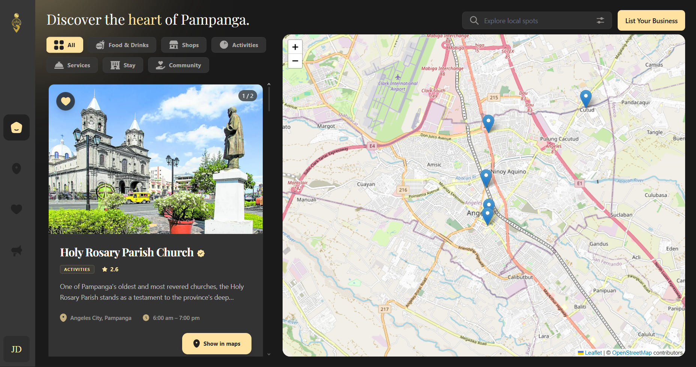
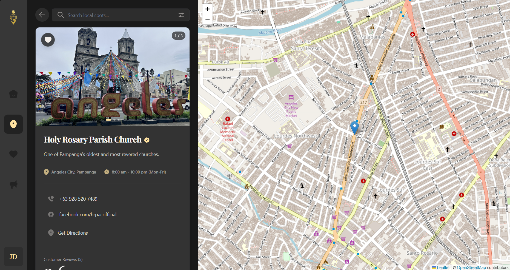
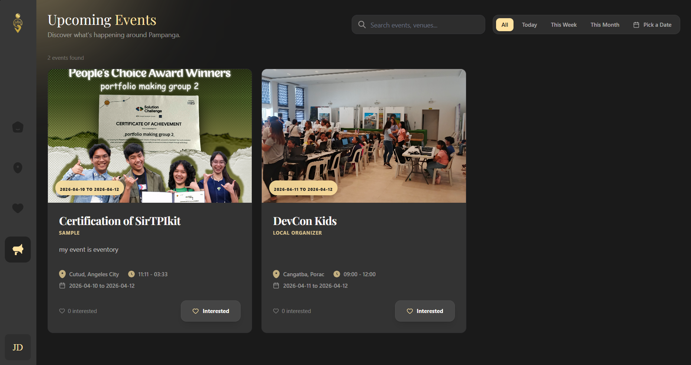
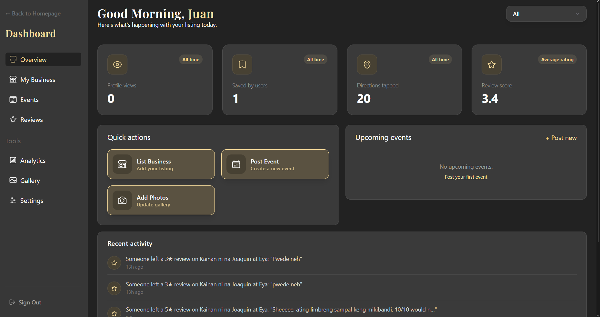
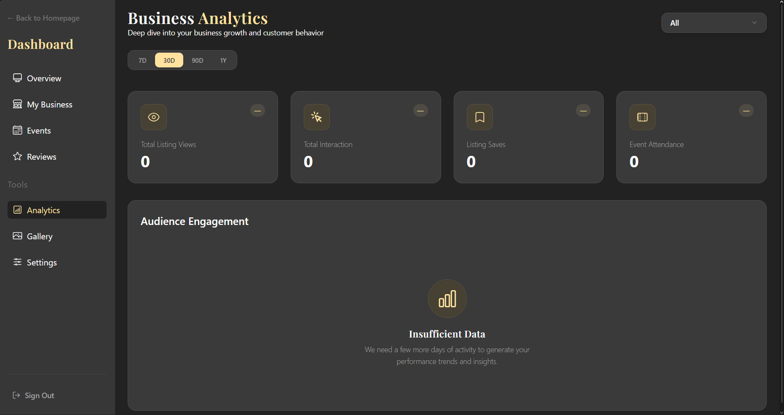

<p align="center">
  
</p>
<h1 align="center">Salangi</h1>
<p align="center">An open source platform for discovering and supporting authentic Kapampangan local businesses.</p>

## Overview

Salangi is a discovery platform that helps local Pampanga businesses build a simple digital presence while allowing locals and tourists to explore authentic Kapampangan food, crafts, pasalubong, cafés, and sari-sari stores. Businesses can showcase photos, share their story, and connect with customers directly through messaging, all within a searchable map-based directory rooted in the Kapampangan spirit of community.

## Problem & Objective

Many small businesses in Pampanga lack a digital presence, making it difficult for locals and tourists to discover authentic Kapampangan products and services. Without a simple platform to showcase their stories and offerings, these businesses have limited visibility and opportunities to reach more customers.

## Tech Stack

### Frontend

- **Framework**: [React 19](https://react.dev/) + [Vite](https://vitejs.dev/)
- **Language**: [TypeScript](https://www.typescriptlang.org/)
- **Styling**: [Tailwind CSS v4](https://tailwindcss.com/)
- **Animations**: [Tailwind CSS Motion](https://github.com/romboHQ/tailwindcss-motion)
- **Routing**: [React Router v7](https://reactrouter.com/)
- **State Management**: [TanStack Query v5](https://tanstack.com/query/latest)
- **Maps**: [Leaflet](https://leafletjs.com/)
- **Icons**: [Lucide React](https://lucide.dev/) & [React Icons](https://react-icons.github.io/react-icons/)

### Backend

- **Framework**: [FastAPI](https://fastapi.tiangolo.com/)
- **Database ORM**: [SQLAlchemy 2.0](https://www.sqlalchemy.org/)
- **Validation**: [Pydantic v2](https://docs.pydantic.dev/)
- **Security**: [Bcrypt](https://pypi.org/project/bcrypt/), [JOSE/JWT](https://python-jose.readthedocs.io/), [Passlib](https://passlib.readthedocs.io/)
- **Environment**: [Python-dotenv](https://pypi.org/project/python-dotenv/)
- **Server**: [Uvicorn](https://www.uvicorn.org/)

### Infrastructure & Services

- **Database & Authentication**: [Supabase](https://supabase.com/) (PostgreSQL)
- **Email Service**: [Resend](https://resend.com/)
- **Development Tools**: [ESLint](https://eslint.org/), [Prettier](https://prettier.io/)
- **Deployment**: [Render](https://render.com/)

## Features

- **Business Management**: Dedicated dashboard for local business owners to manage their listings, post events, and view analytics.
- **Admin Verification Portal**: Fully responsive dashboard for administrators to review and approve new business listings and community events.
- **Discovery Map**: Interactive, searchable map directory letting users find authentic Kapampangan products and experiences in real-time.
- **Community Events**: Keep up with local festivities and events happening across the province.
- **Mobile-First Experience**: Fully responsive interface optimized for seamless exploration across all devices.

## Installation Guide

### Prerequisites

- **Node.js**: v18.0 or higher
- **Python**: 3.9 or higher
- **Supabase Account**: For database and authentication

### 1. Clone the repository

```bash
git clone <repository-url>
cd Salangi
```

### 2. Frontend Setup

```bash
cd frontend
npm install
cp .env.example .env
```

Update the `.env` file in the `frontend` directory:

### 3. Backend Setup

In another terminal:

```bash
cd backend
python -m venv venv

# Windows
.\venv\Scripts\activate

# macOS/Linux
source venv/bin/activate

pip install -r requirements.txt
cp .env.example .env
```

Update the `.env` file in the `backend` directory:

## Development

### Running the Frontend

```bash
cd frontend
npm run dev
```

The app will be available at `http://localhost:5173`

### Running the Backend

```bash
uvicorn backend.main:app --reload
```

The API will be available at `http://localhost:8000`

## Contributing

Contributions are welcome! Please follow these steps:

1. Fork the repository
2. Create a feature branch (`git checkout -b feature/AmazingFeature`)
3. Commit your changes (`git commit -m 'add: some AmazingFeature'`)
4. Push to the branch (`git push origin feature/AmazingFeature`)
5. Open a Pull Request

## Screenshots

### 1. Authentication

<table align="center">
  <tr>
    <td align="center"><br></td>
    <td align="center"><br></td>
  </tr>
</table>

### 2. Dashboard

<table align="center">
  <tr>
    <td align="center"><br></td>
    <td align="center"><br></td>
  </tr>
  <tr>
    <td align="center" colspan="2"><br></td>
  </tr>
</table>

### 3. Business Dashboard

<table align="center">
  <tr>
    <td align="center"><br></td>
    <td align="center"><br></td>
  </tr>
  <tr>
    <td align="center" colspan="2"><br></td>
  </tr>
</table>

## Team

- [Joshua Emmanuel Halili](https://www.linkedin.com/in/joshua-emmanuel-m-halili-133155377/)
- [Angel Rhian Lising](https://www.linkedin.com/in/angel-rhian-lising-084794244/)
- [Caleb Manalo](https://www.linkedin.com/in/caleb-manalo/)
- [Angelica Mae Tadique](https://www.linkedin.com/in/angelica-mae-tadique/)
- [Kevin Yeban](https://www.linkedin.com/in/kevin-marquez-yeban/)

##

<p align=center><strong>Built with ❤️ by Salangi</strong></p>
